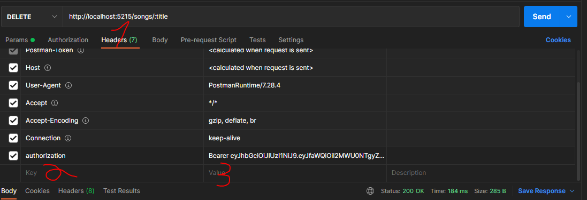

# songs server

# technologies used:

[סיכום עברית](./summary_he.md)

## dotenv

we learned to dotenv library in nodejs

```
npm i dotenv
```

make a file called ".env" in the main folder, and add the file to .gitignore

```
.env
```

in our main file (server.js) import the dotenv,
and directly call the config function of the module

```js
require("dotenv").config();
```

and after that every file in our server can access the env variables like so:

```js
process.env.MY_VAR;
```

### notes:

- no " or ; in the .env file
- need to call config() only once

## Router

to split the files for every route, we need to use the built-in Router of express
likes this in the [file](./routes/songs.js) of your route (ex.:"./routes/songs.js"):

```js
// get the router from express
const router = express.Router();

// define your diferrent routes
router.get("/songs2", async (req, res) => {
  console.log("songs 2");
  res.send("songs 2");
});

// export the router
module.exports = router;
```

then have a main router [file](./routes/router.js) that imports all the routes and exports them

```js
// import all relevant routes
const songsRoute = require("./songs");
const usersRoute = require("./users");

// export them in a single object
module.exports = { songsRoute, usersRoute };
```

in the main server [file](./server.js) import all the routes from the router [file](./routes/router.js)
and in the code tell express to use those routes

```js
// import routes
const { songsRoute, usersRoute } = require("./routes/router.js");

// define routes for express
app.use("/songs", songsRoute);
app.use("/users", usersRoute);
```

and the every request that our server gets and have /songs/something, gets handled by the [songs.js](./routes/songs.js) file

## Hashing using bcypt

to secure our users' password we don't want to store the password as a simple text.<br>
we want to [hash](https://en.wikipedia.org/wiki/Hash_function) the password.<br>

an easy tool for nodejs is bcrypt. first install bcrypt.

```
npm i bcrypt
```

### hash

and then lets see an example of how to use it.
in my code it can be found in [this file](./routes/users.js)

```js
// import bcrypt
const bcrypt = require("bcrypt");

// remember: must be in an async function
const hashedPassword = await bcrypt.hash(password, 10);
```

and the hashedPassword is stored in our database and not the real password

### compare

```js
// must be in an async function
const match = await bcrypt.compare(password, hashedPassword);
```

and then match===true if the password the user gave me matches the hashed password in our database

## JsonWebToken

we don't want the user to send his password every time he reload the page<br>
so, we still want to recognize him somehow.<br>

this is what a web token came to solve.

```
npm i jsonwebtoken
```

the server takes the user details, and encrypts them with a key that **only the server** knows, not even the user can decrypt it.

```js
// import the module
const jwt = require("jsonwebtoken");

// generate an access token using jwt
const accessToken = jwt.sign(JSON.stringify(user), process.env.TOKEN_SECRET);

// send the access token to the user
res.json(accessToken);
```

the encryption key in the code is `process.env.TOKEN_SECRET` and only with it the encryption can be opened.

the access token is an alternative to send a password every time,<br>
the server assign a token for each user logged in and when the user refresh the page, the browser needs only to send the token.

sending the access token to the server can be done automatically, without the user intervention.

after the user logged in, all we need is the token.<br> so, we will make a function that confirms that the user is the one logged in by using the token

in our main [server file](./server.js)

```js
const authJWT = (req, res, next) => {
  // the authorization loks like "barrier <token>"
  const authHeader = req.headers.authorization;

  if (authHeader) {
    // get only the <token>
    const token = authHeader.split("")[1];

    // verify the given token (decrypt) with the secret saved in the server
    jwt.verify(token, process.env.TOKEN_SECRET, (err, user) => {
      if (err) {
        return res.sendStatus(403);
      }

      // add the user to the req. user is already verified.
      req.user = user;

      //
      next();
    });
  } else {
    return res.sendStatus(401);
  }
};
```

the idea:<br>
this function verifies the user with the users' `token` and my `TOKEN_SECRET`.<br>
and the rest of the server is using the user as a simple, unencrypted user.

in the defining of routes in the main server file to add my middleware:<br>
`app.use("/songs", songsRoute);`->`app.use("/songs", authJWT, songsRoute);`

and in the server request we need to send the server the token as a header like so:


and in the regular path, for example in delete, to check the user we just need to do

```js
// userName is how i named it, noam named it diferrently
if (req.user.userName === song.user)
```
